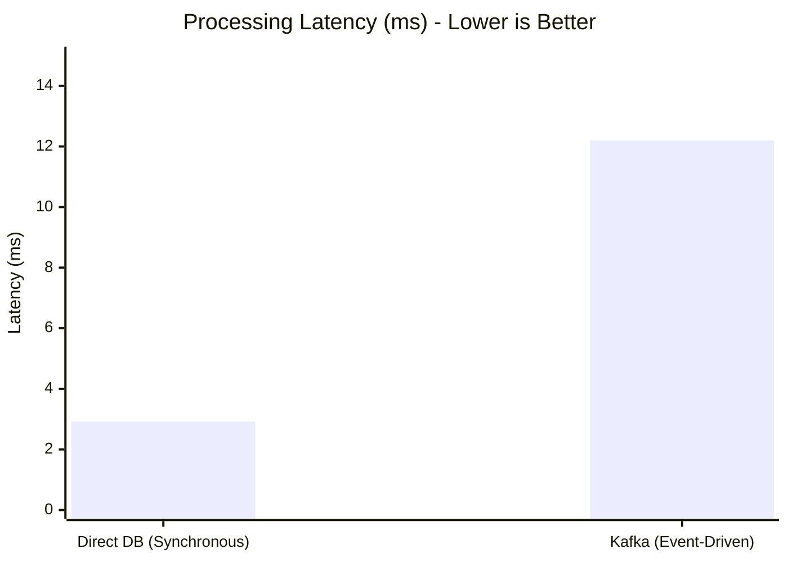
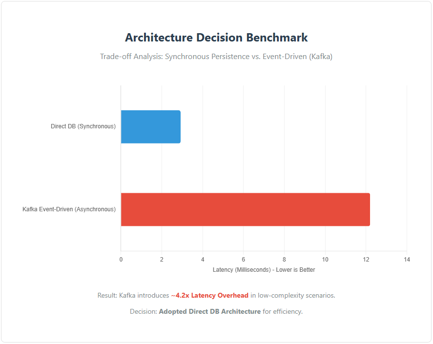
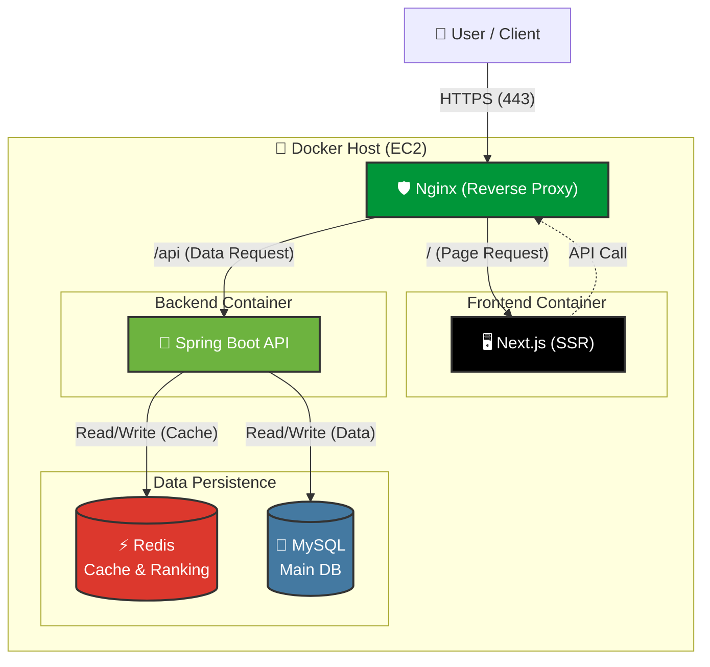

# 🚀 [Project] 고성능/고효율 CBT(Computer Based Test) 플랫폼

> **"한정된 리소스(t3.small) 내에서 최대의 성능을 이끌어내기 위한 아키텍처 최적화"**  
> Redis 기반의 실시간 랭킹 시스템과 데이터 기반의 아키텍처 의사결정(Anti-Overengineering)을 통해 **안정성과 효율성**을 모두 잡은 온라인 시험 플랫폼입니다.

---

## 1. 프로젝트 개요 (Overview)

- **개발 기간:** 2024.12 ~ 2025.01 (진행 중)
- **참여 인원:** 백엔드 1명 (본인 - 인프라/DB 설계 포함), 프론트엔드 1명
- **주요 기능:** 시험 응시, 자동 채점, 실시간 랭킹, 관리자 문항 관리
- **Github Repository:** [링크 삽입]

### 🛠 Tech Stack

| Category           | Technology                                                |
| ------------------ | --------------------------------------------------------- |
| **Language**       | Java 17, TypeScript                                       |
| **Framework**      | **Spring Boot 3.x**, JPA (Hibernate), Next.js 14          |
| **Database**       | MySQL 8.0, **Redis (Caching & Ranking)**                  |
| **Infra & DevOps** | AWS (EC2 t3.small), Docker Compose, Nginx, GitHub Actions |
| **Security**       | Spring Security, JWT                                      |

---

## 2. 핵심 기술적 의사결정 (Technical Decision Making) ⭐⭐⭐

단순한 기술 도입이 아닌, **"데이터와 벤치마크"**에 기반하여 합리적인 기술셋을 선택했습니다.

### A. 아키텍처 검증: Kafka 도입 보류와 경량화 전략

현재 프로젝트 규모에서 Kafka 도입이 미치는 영향을 데이터로 검증한 결과입니다.

> **[벤치마크 결과 상세]**
>
> - **Direct DB (Sync):** 2.92 ms
> - **Kafka (Async):** 12.20 ms (약 4.2배 오버헤드 발생)

- **배경 (Context):** 로그 수집 및 비동기 처리를 위해 Event-Driven Architecture(Kafka) 도입을 고려.
- **검증 (PoC & Benchmark):**
  - 현재 프로젝트 규모와 리소스(t3.small, 2vCPU/2GB RAM)에서의 효용성을 검증하기 위해 벤치마크 수행.
  - **결과:** 단순 로직 처리 시 Kafka 도입이 Direct DB 처리 대비 **Latency가 약 4.2배 증가**함을 확인.
- **결정 (Decision):**
  - **"오버엔지니어링(Over-engineering) 방지"**를 위해 Kafka 도입을 보류.
  - 대신 **Redis Pub/Sub**과 **Direct DB** 방식을 채택하여 인프라 비용을 절감하고 응답 속도를 최적화함.

---

### B. Redis Sorted Set을 활용한 실시간 랭킹 시스템

**[첨부: 랭킹 페이지(cbt-fe/app/ranking/page.tsx) 스크린샷]**

- **문제 (Problem):**
  - 시험 종료 직후 수많은 사용자가 동시에 랭킹을 조회.
  - RDB(MySQL)에서 `ORDER BY score DESC, submitted_at ASC` 쿼리 실행 시, 데이터 증가에 따라 조회 속도가 선형적으로 느려지는 문제 발생.
- **해결 (Solution):**
  - In-Memory DB인 **Redis의 Sorted Set (ZSet)** 자료구조 도입.
  - 시험 제출(`AttemptService`)과 동시에 Redis에 점수(`Score`)를 Add, 조회 시 메모리에서 즉시 반환.
- **성과:**
  - 랭킹 산정 시간 복잡도를 **O(log N)**으로 단축.
  - RDB 부하를 제거하여 동시 접속 상황에서도 안정적인 응답 속도 보장.

### C. JPA N+1 문제 해결 및 쿼리 최적화

**[첨부: 시험 상세 화면(cbt-fe/app/exam/[id]/page.tsx) 스크린샷]**

- **이슈:** `Exam`(시험) 조회 시 연관된 `Question`(문제)과 `Choice`(선지)를 가져오기 위해 수십 번의 추가 쿼리가 발생하는 N+1 문제 확인.
- **해결:**
  - 단순 `Lazy Loading`에 의존하지 않고, **`Fetch Join`**을 적용하여 한 번의 쿼리로 필요한 연관 데이터를 모두 조회.
  - `default_batch_fetch_size` 옵션을 설정하여 컬렉션 조회 시 `IN` 절을 활용해 쿼리 수 최소화.

---

## 3. 서비스 아키텍처 (System Architecture)

GitHub Mermaid를 활용한 전체 시스템 구성도입니다. **Nginx**가 진입점에서 리버스 프록시 및 SSL 종료(Termination) 역할을 수행하며, URL 경로(`/api` vs `/`)에 따라 트래픽을 라우팅합니다.

### 아키텍처 특징

- **Single Entry Point:** 모든 요청은 Nginx(443)를 통해서만 진입 가능하며, 내부 WAS 및 DB 포트는 외부로 노출되지 않습니다.
- **Path-Based Routing:** `/api/**` 요청은 Spring Boot 백엔드로, 그 외 요청은 Next.js 프론트엔드로 자동 분기됩니다.
- **Layered Storage:** 빈번한 조회(랭킹, 토큰)는 Redis가, 영구 저장이 필요한 데이터는 MySQL이 담당하여 부하를 분산합니다.

---

## 4. 주요 트러블슈팅 (Troubleshooting)

### ① 동시성 이슈 없는 채점 시스템 구현

- **상황:** 사용자가 답안을 제출하는 순간 채점, 점수 저장, 랭킹 갱신, 오답 노트 생성이 동시에 이루어져야 함.
- **해결:**
  - `GradingService`를 분리하여 채점 로직의 독립성 확보.
  - `@Transactional`의 전파 속성을 고려하여, 채점 도중 예외 발생 시 점수 저장과 랭킹 갱신이 모두 **원자적(Atomic)**으로 롤백되도록 구현하여 데이터 무결성 보장.

### ② 보안과 편의성의 균형 (JWT + Redis)

**[첨부: 로그인 화면(cbt-fe/app/login/page.tsx) 스크린샷]**

- **고민:** JWT는 탈취 시 만료될 때까지 막을 수 없는 보안 취약점이 존재.
- **해결:**
  - **Refresh Token을 Redis에 저장**하고 TTL(Time-To-Live)을 설정.
  - 로그아웃 시 해당 토큰을 Redis에서 삭제하거나 Blacklist로 등록하여, 보안성을 유지하면서도 서버 세션의 부담을 없앰.

---

## 5. 코드 품질 및 유지보수 전략 (Code Quality & Maintainability)

> **"비즈니스 로직에만 집중할 수 있는 깔끔한 코드 구조 지향"**

- **AOP(Aspect-Oriented Programming)를 통한 관심사 분리:**
  - `LoggingAspect` 등을 통해 비즈니스 로직 내에 로깅 코드가 침투하는 것을 방지. 공통 관심사를 분리하여 핵심 로직의 가독성과 응집도 향상.
- **DTO(Data Transfer Object) 패턴 준수:**
  - API 통신 시 `Entity`를 절대 외부로 노출하지 않고, 각 요청/응답에 최적화된 DTO를 별도로 정의.
  - 이를 통해 DB 스키마 변경이 API 클라이언트에 미치는 사이드 이펙트를 차단하고 보안성 강화.
- **Layered Architecture:**
  - Controller(표현) - Service(비즈니스) - Repository(영속성) 계층을 엄격히 분리하여, 단위 테스트가 용이하고 유연한 확장성을 가진 구조 유지.

---

## 6. 향후 개선 계획 (Future Roadmap)

현재는 비용 효율적인 아키텍처에 집중했지만, 트래픽 급증 시의 스케일업(Scale-up) 시나리오도 준비되어 있습니다.

1.  **비동기 큐 도입 (Kafka/RabbitMQ)**

    - **Trigger:** 동시 접속자가 급증하여 Redis Pub/Sub의 신뢰성 보장이 한계에 도달할 때.
    - **Plan:** 채점 결과 알림 등의 후처리 로직을 메시지 큐로 분리하여 시스템 결합도 완화.

2.  **모니터링 고도화 (PLG Stack)**

    - **Plan:** 무거운 ELK 스택 대신 경량화된 **Loki + Promtail + Grafana** 조합을 도입하여, 서버 리소스를 적게 점유하면서도 실시간 로그 시각화 환경 구축.

3.  **DB 이중화 및 인덱싱**
    - **Plan:** 데이터 축적 시 `Replication (Master-Slave)` 구조로 전환하여 읽기 성능을 분산하고, 조회 쿼리 패턴 분석을 통한 복합 인덱스(Composite Index) 최적화 수행.
