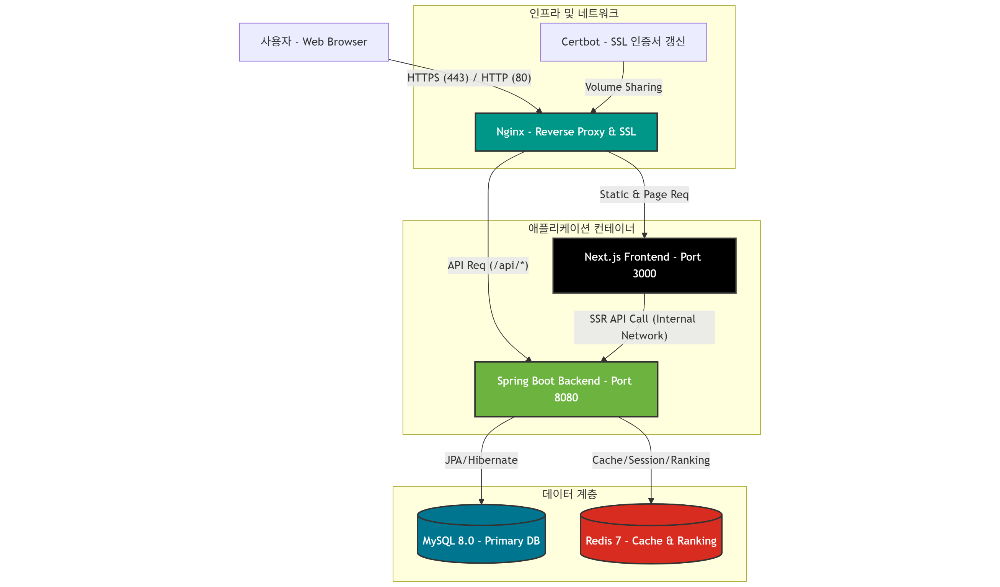
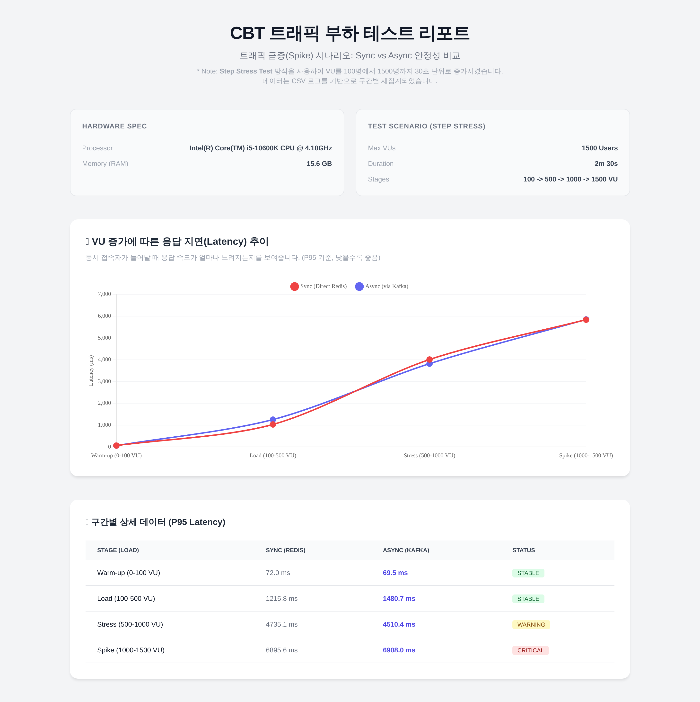

# 🚀 OptiCBT (High-Performance Online Exam Platform)

[](https://spring.io/projects/spring-boot)
[](https://nextjs.org/)
[](https://redis.io/)
[](https://www.docker.com/)

**OptiCBT**는 대규모 동시 접속 상황에서도 안정적인 시험 응시와 실시간 랭킹 산정을 보장하는 **고성능 온라인 CBT(Computer Based Testing) 플랫폼**입니다.  
**"Anti-Overengineering & Data-Driven Decision"** 철학을 바탕으로, 불필요한 복잡성을 배제하고 실제 성능 데이터에 기반하여 최적의 아키텍처를 설계했습니다.

---

## 🏛 Service Architecture



시스템은 **MSA(Microservices Architecture)를 지향하는 모듈형 모놀리스(Modular Monolith)** 구조로 설계되었으며, Docker Compose를 통해 전체 인프라가 오케스트레이션됩니다.

*   **User Interface**: Next.js (App Router) 기반의 SPA로, 빠른 초기 로딩과 SEO를 동시에 만족합니다.
*   **API Server**: Spring Boot 3.x 기반의 RESTful API 서버입니다.
*   **Data Layer**:
    *   **MySQL 8.0**: 사용자 정보, 시험 문제, 응시 이력 등 영구 데이터 저장.
    *   **Redis 7.x**: 실시간 랭킹 산정(Sorted Set) 및 세션/토큰 관리(Cache).
*   **Gateway**: Nginx를 리버스 프록시로 사용하여 SSL Termination 및 정적 리소스 서빙을 담당합니다.

---

## 💡 Key Technical Features

### 1. 실시간 랭킹 시스템 (Redis Sorted Set)
*   **Challenge**: 수만 명의 응시자가 동시에 시험을 종료할 때, RDB(`ORDER BY`)로 랭킹을 계산하면 DB 부하가 급증하여 데드락이나 타임아웃이 발생할 수 있습니다.
*   **Solution**: **Redis Sorted Set (ZSet)** 자료구조를 도입했습니다.
    *   점수 업데이트 및 순위 조회가 **O(log N)**의 시간 복잡도로 수행됩니다.
    *   `SubmissionRankingService`를 통해 시험 종료 즉시 메모리 상에서 순위가 갱신됩니다.

### 2. 고성능 보안 인증 (JWT + RTR)
*   **Strategy**: Stateless한 **JWT(Access Token)**와 Stateful한 **Refresh Token**을 결합한 하이브리드 방식입니다.
*   **RTR (Refresh Token Rotation)**: Access Token 재발급 시 Refresh Token도 함께 교체하여, 토큰 탈취 시 피해를 최소화하는 **RTR 전략**을 구현했습니다.
*   **Logout Handling**: 로그아웃 시 남은 Access Token 유효시간 동안 Redis Blacklist에 등록하여 접근을 원천 차단합니다.

### 3. 데이터 무결성 및 최적화
*   **Atomic Grading**: 답안 제출, 자동 채점, 점수 저장, 랭킹 반영의 전 과정이 **@Transactional** 안에서 원자적(Atomic)으로 수행되어 데이터 불일치를 방지합니다.
*   **JPA Optimization**: 복잡한 시험지-문항-보기 데이터 조회 시 `@EntityGraph`와 `Batch Fetching`을 적용하여 **N+1 문제**를 해결했습니다.

---

## ⚖️ Architectural Decision: Direct Redis vs Kafka

프로젝트 초기, 트래픽 폭주(Spike) 대응을 위해 **Kafka 비동기 처리** 도입을 고려했으나, 실제 부하 테스트 결과를 바탕으로 **Direct Redis(Sync)** 방식을 채택했습니다.

### 🧪 Benchmark Report (1500 VUs Step Stress)
**테스트 환경**: Docker Compose (Local), 1500 Concurrent Users



| Metric | Sync (Direct Redis) | Async (Kafka) | Analysis |
| :--- | :--- | :--- | :--- |
| **Stability** | **Stable (0% Error)** | Stable (0.1% Error) | Redis 직접 쓰기 방식도 1500 VU 부하를 에러 없이 처리했습니다. |
| **P95 Latency** | 7,116 ms | **6,339 ms** | Kafka 도입 시 약 **11% (0.8초)**의 성능 개선이 있었습니다. |
| **Complexity** | Low | **High** | Kafka/Zookeeper 운영 비용 및 메모리 오버헤드가 큽니다. |

**결론**: 11%의 성능 향상을 위해 Kafka의 높은 운영 비용을 지불하는 것은 **Over-engineering**이라고 판단했습니다. 따라서 초기 모델은 **Direct Redis** 아키텍처로 구축하여 개발 생산성과 운영 효율성을 확보했습니다.

---

## 🛠 Tech Stack

### Backend
*   **Framework**: Spring Boot 3.5.7
*   **Language**: Java 17
*   **Data**: Spring Data JPA, QueryDSL
*   **Security**: Spring Security, JJWT
*   **Test**: JUnit 5, Mockito

### Frontend
*   **Framework**: Next.js 15 (App Router)
*   **Language**: TypeScript
*   **Styling**: Tailwind CSS
*   **State**: Zustand, React Query
*   **HTTP**: Axios

### Infrastructure
*   **DB**: MySQL 8.0
*   **Cache**: Redis 7.0
*   **DevOps**: Docker, Docker Compose
*   **Load Testing**: k6

---

## 📂 Project Structure

```bash
CBT/
├── cbt-be/                 # Backend (Spring Boot)
│   └── src/main/java/com/example/cbt/
│       ├── attempt/        # 응시 및 채점 도메인
│       ├── auth/           # 인증/인가 (JWT)
│       ├── exam/           # 시험 관리 도메인
│       ├── ranking/        # 랭킹 서비스 (Redis)
│       └── grading/        # 자동 채점 로직
├── cbt-fe/                 # Frontend (Next.js)
│   └── app/                # App Router Pages
│       ├── admin/          # 관리자 페이지
│       ├── exam/           # 시험 응시 페이지
│       └── ranking/        # 랭킹 페이지
├── docker-compose.local.yml # 로컬 개발용 인프라 설정
└── tests/k6/               # 부하 테스트 스크립트 및 리포트
```

---

## ⚡ Getting Started

### Prerequisites
*   Docker & Docker Compose

### Run Application
프로젝트 루트에서 다음 명령어를 실행하면 모든 서비스가 구동됩니다.

```bash
# 실행
docker-compose -f docker-compose.local.yml up -d --build

# 종료
docker-compose -f docker-compose.local.yml down
```

*   **Frontend**: [http://localhost:3000](http://localhost:3000)
*   **Backend API**: [http://localhost:8080](http://localhost:8080)
*   **Swagger Docs**: [http://localhost:8080/swagger-ui/index.html](http://localhost:8080/swagger-ui/index.html)